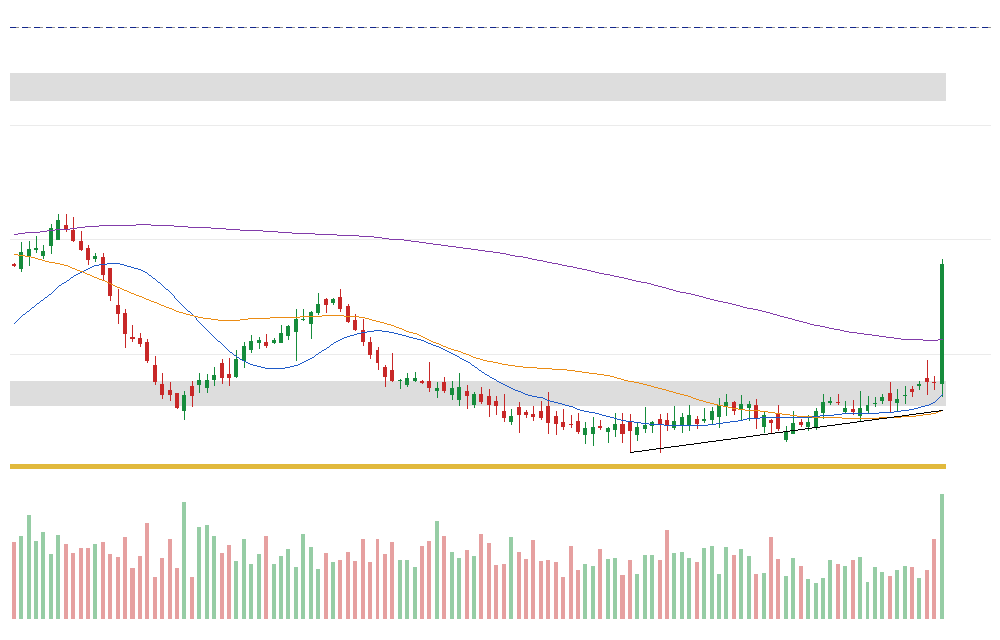
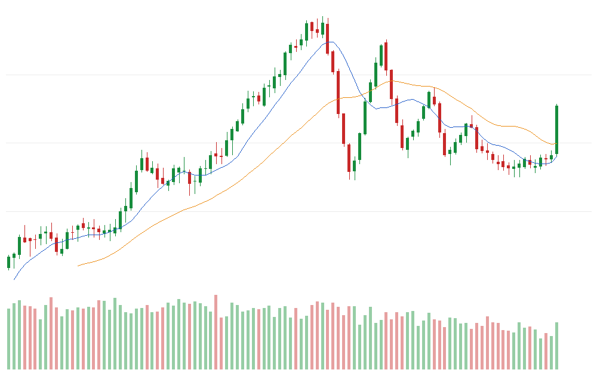

# P5-CP1 — Structured Historical Chart Analysis Architecture Proposal (DESIGN ONLY; STOP)

- **Date:** 2026-10-05.
- **Owner direction:** "Phase 5 — Design a Structured Historical Chart Analysis Research Framework" (2026-10-05, D150; summary in `docs/owner/2026-10-05_phase5_chart_analysis_design.md`).
- **Status:** **architecture proposal only.**

**What was NOT done:**
- no chart strategy backtested;
- no chart score computed on any real stock;
- no historical chart inspected;
- no AI call;
- no portfolio;
- no 2018–2021 data; the Holdout is untouched;
- nothing bought.

**What was built** (all synthetic and tested; it supports this design and is not a frozen specification):
- `research/phase5/p5_chart.py`: deterministic, point-in-time chart algorithms;
- `research/phase5/p5_render.py`: a dependency-free, byte-reproducible renderer;
- `research/phase5/p5_synth.py` and `p5_demo.py`: synthetic bars and demo charts;
- `tests/test_p5_chart.py`: 35 leakage-canary and architecture tests.

## Short answer

1. **The concept is reproducible.** Daily and Weekly charts can be reconstructed faithfully from our point-in-time data. Trendlines, support / resistance, swing structure, bases and breakouts can all be defined without hindsight; the leakage canaries pass on synthetic data.
2. **A fixed, explicit rubric (option B) is the only implementation that fits the project's rules and data licence.** Visual AI scoring of historical charts (option C) is blocked by three separate facts:
   - **Data licence:** a candlestick chart reproduces the raw OHLCV data, and QuantConnect does not allow that to leave the platform.
   - **Repo protocol:** signals must be deterministic code (CLAUDE.md).
   - **Reproducibility:** current Claude models offer no temperature control, and models are retired.
3. **Only partly new.** The weekly-trend part of a chart rubric largely re-tests ideas that already failed here (H002, H003, H006, H007, H018, H019). The base, support / resistance and breakout geometry is new to the programme.
4. **Statistical power is similar to H019:** about 5%/yr is the smallest top-group edge detectable at 50% power.
5. **Recommendation (owner decision):**
   - If you want to continue technical stock-selection research, the defensible form is **one** pre-registered deterministic chart-quality rubric (H020), tested first at the signal level, inside QuantConnect.
   - AI stays out of the historical study. At most, an outcome-free consistency study on synthetic charts.
   - Stopping remains an honest alternative.

---

## 1. Research hypothesis

**H020 (proposed name; not registered).** A chart contains relational and path information that isolated scalar indicators do not capture:
- trend structure;
- consolidation geometry;
- support / resistance;
- volatility contraction;
- volume behaviour.

So a fixed, pre-registered combination of Weekly and Daily chart characteristics, scored by one frozen rubric, ranks large US stocks by *setup quality*: higher-quality setups subsequently outperform lower-quality setups, beyond plain momentum.

**Is the hypothesis reasonable? Partly.**
- **For it:**
  - Lo, Mamaysky & Wang (2000) showed that algorithmically detected visual patterns carry some incremental information.
  - Savin et al. (2007) found head-and-shoulders patterns predict excess returns, though they are not profitable stand-alone.
  - Support / resistance levels coincide with order-book depth (Kavajecz & Odders-White 2004).
  - These are mechanisms by which path geometry can matter.
- **Against it:**
  - The effects are modest, mostly pre-2000, and on broader or smaller universes.
  - Practitioner pattern failure rates roughly doubled in the 2000s (Bulkowski).
  - In our own ≥ $2B sample, every isolated trend / momentum / breakout / volume test failed (H002, H003, H006, H007, H009, H018, H019).
  - The rubric's genuinely new content is the conjunction and the geometry. That is a plausible but weakly evidenced source of information.

## 2. Why this differs from H018 and H019 (and where it does not)

| | H018 (Phase 3) | H019 (Phase 4) | Proposed H020 |
|---|---|---|---|
| Object tested | 1,533 rule configurations (≤ 3 conditions each) | 3 scalar signals | **One** fixed rubric: about 20 binary chart conditions + disqualifiers |
| Information | Indicator thresholds (RSI, SMA distance, N-day high, relative volume) | Return sums (momentum, smoothness, MA ratios) | **Path geometry**: confirmed swing points, HH / HL state, bases and their contraction sequence, support / resistance zones, trendlines, breakout from an *established* level, volume dry-up, extension from support |
| Search | Optimizer + plateau rule | None | **None** (thresholds = practitioner conventions written down before any data) |
| Test | Portfolio books | Cross-sectional signal | Cross-sectional signal (H019-style), portfolio only later |

**Honest overlap.** Category W (weekly trend) is essentially trend / momentum, which failed in H002, H003, H018 and H019. Category T (trigger) overlaps the breakout and volume ideas of H006, H007 and H009, and the breakout family of H018.

**What is genuinely new to this programme:**
- swing-point structure (HH / HL);
- base geometry and contraction sequence;
- horizontal support / resistance zones;
- support trendlines;
- "breakout from an established structure" as opposed to "new N-day high";
- defined risk to support;
- above all, scoring all of these jointly.

**If H020's predictive content came only from category W, it would merely recreate H018 / H019 visually.** The validation therefore requires incremental value over momentum, and it decomposes the score into categories as a diagnostic (section 28).

## 3. Finviz inspiration vs historical implementation (section 33 of the brief)

| | Finviz (live) | Our historical reconstruction |
|---|---|---|
| Screener | Yes, current values; CSV export (Elite) | Our own point-in-time universe (data v1: ≥ $2B, ≥ $5, ADV20 ≥ $5M) |
| Technical statistics (SMA distances, RSI, ATR, 52-week high / low, relative volume, performance) | Yes, as of today | **Reconstructable** exactly from daily OHLCV through date t |
| Daily / Weekly charts | Yes, rendered today | **Reconstructable**: our own renderer, frozen format, only bars ≤ t |
| Automatic pattern recognition (wedges, channels, double bottoms, …) and trendlines | Yes (proprietary algorithm; Elite) | **Not reconstructable historically.** We replace them with our own documented algorithms (pivots, zones, trendlines, bases), which are reproducible and point-in-time |
| Historical screener values / pattern labels as they appeared on a past date | **No** genuine point-in-time archive known | **Unavailable**: never used as historical truth |
| Sector / industry | Current classification | Point-in-time SEC SIC (data v1); approximation of Finviz sectors |
| Earnings date | Yes | SEC 8-K timestamps (Event Data v1; ≈ 94% coverage); approximation |
| Float, short float, analyst, insider, institutional, news | Yes | **Unavailable or unsafe** (share counts are split-adjusted to today, D107); not used |

**Finviz role:** layout inspiration, and possibly a future live screener. It is never the source of historical truth. Buying Finviz Elite is not proposed.

## 4. Data feasibility audit (section 34 of the brief)

| Feature | Status | Note |
|---|---|---|
| Daily OHLCV, split- and total-return-adjusted as known at t | **Available PIT** | QuantConnect RAW bars × its own split / dividend feeds, as verified in H019 (E985-05) |
| Weekly bars | **Reconstructable** | ISO-week aggregation of sessions ≤ t (partial current week flagged) |
| MAs (20 / 50 / 200 d; 10 / 30 / 40 w), ATR, Bollinger width, realised volatility, RSI | **Reconstructable** | — |
| 52-week high / low, distance from them | **Reconstructable** | — |
| Volume, relative volume, up/down volume, distribution days | **Reconstructable** | Split-adjusted volume |
| Swing points, HH / HL state, S/R zones, trendlines, bases, breakouts, extension | **Reconstructable** | Our algorithms (section 6–14); canary-tested on synthetic data |
| Relative-strength line vs SPY | **Reconstructable** | SPY total return in the same panel |
| Market cap, liquidity eligibility | **Available PIT** | Data v1 |
| Sector | **Requires approximation** | PIT SEC SIC → FF12 (Morningstar sector is current-status) |
| Earnings dates (for an "earnings soon" caution) | **Requires approximation** | SEC 8-K timestamps |
| Float, short interest, analyst, insider, institutional ownership, news | **Unavailable / unsafe / out of scope** | — |
| Finviz proprietary pattern labels or annotations, historically | **Unavailable** | — |
| Historical chart *images* outside QuantConnect | **Not permitted** | QuantConnect licence: images may be shared only if the original data can't be reconstructed from them. A candlestick chart is a reconstruction. |

**Conclusion:** every feature the rubric needs can be reconstructed point-in-time inside QuantConnect. No key feature is missing, and no data purchase is needed.

## 5. Historical snapshot specification

A **snapshot** is the record (stock, decision bar t), computed only from bars ≤ t:
- **identity:** an internal id (no ticker or name in anything a model would see) plus point-in-time market cap and FF12 sector;
- **daily bars:** the last 252 sessions (126 drawn);
- **weekly bars:** the last 104 weeks (partial current week flagged);
- **technical summary:**
  - MAs;
  - ATR%;
  - distance from the 52-week high / low;
  - relative volume;
  - extension (ATR-normalised);
- **structure objects:**
  - confirmed swing points (daily, weekly);
  - weekly and daily HH / HL state;
  - nearest support and resistance zones;
  - the active support trendline;
  - the current base and its metrics;
  - the active breakout;
- **volume behaviour:** dry-up ratio; up/down volume; distribution days;
- **risk definition:** defined support and risk-to-support;
- **checklist:** category scores, total and disqualifiers.

The reference implementation `p5_chart.snapshot()` returns exactly this. Every element is a pure function of bars ≤ t; section 22 lists the tests that enforce this.

## 6. Daily chart specification (role: setup and entry timing)

| Parameter | Value |
|---|---|
| Role | Entry setup: short / medium consolidation, breakout, pullback / recovery, volume behaviour, volatility contraction, distance from support, immediate risk / reward |
| Look-back | 126 sessions drawn (~6 months); 252 sessions computed (pivots, zones, trendlines, 52-week high) |
| Overlays | MA20, MA50, MA200; **nearest** resistance and support zones only; the active ascending support trendline; breakout level (dashed); 52-week high (dotted); base-span strip |
| Not shown | RSI / MACD panels (not part of the rubric; Tier D in P4-CP2) |

## 7. Weekly chart specification (role: is the stock worth considering?)

| Parameter | Value |
|---|---|
| Role | Long-term trend, weekly structure (HH / HL), major base / support / resistance, long-term relative strength |
| Look-back | 104 weeks drawn and computed |
| Overlays | 10-week and 30-week MAs only (the 40-week MA is used as a disqualifier but not drawn); the structure is read from the bars and the confirmed weekly swing points |
| RS line | Computed; **not drawn and not scored** (control variable; section 16) |

**Division of labour:**
- **Weekly decides whether** a stock is a candidate: trend, structure, disqualifiers.
- **Daily decides when:** base, trigger and risk.
- No indicator is duplicated on both timeframes, except price itself.

## 8. Proposed overlays (minimum useful set)

- **Weekly:** candles, volume, MA10w, MA30w.
- **Daily:** candles, volume, MA20, MA50, MA200, nearest S/R zones, one support trendline, breakout level, 52-week high, base strip.
- **Rejected as clutter**, on the synthetic demo:
  - all S/R zones at once;
  - full base shading;
  - RSI / MACD panels;
  - a drawn RS line.

## 9. Trendline algorithm (section 6 of the brief)

| Element | Definition |
|---|---|
| Space | Log price (scale-invariant) |
| Anchors | Two **confirmed** swing lows L1 (older) and L2 (newer), with L2 above L1 |
| Pivot confirmation | Daily k = 5 (Weekly k = 3): bar i is a swing low if l[i] < min of the k bars before and ≤ min of the k bars after. It is **known only at i + k**. |
| Minimum spacing | L2 − L1 ≥ 10 sessions (4 weeks) |
| Tolerance | 0.5 × ATR(20) as a fraction of price |
| Touches | Confirmed swing lows within tolerance of the line (anchors included) |
| Invalidation | Any close after L1 more than the tolerance below the line kills it **permanently** (it never revives) |
| Age | t − L1; anchors must be within the 252-session look-back |
| Coexistence | All valid lines exist. **One is selected deterministically:** most touches, then most recent L2, then earliest L1 |
| Resistance trendlines | Not proposed (horizontal resistance zones cover breakouts; fewer degrees of freedom) |

The "line that looks best" cannot arise: the line is a deterministic function of confirmed pivots. Tests: `test_trendline_invalidation_is_permanent`; future-perturbation invariance.

## 10. Swing-point algorithm

- **Definition:** a fractal of order k (daily 5, weekly 3), confirmed with a k-bar delay. The tie rule is strict on the left and ≥ on the right, so the left-most of equal extremes wins.
- **Prominence filter:** a swing must stand ≥ 1 ATR above (high) or below (low) the opposite extreme since the previous accepted swing. This uses only past bars.
- **No repainting:** the pivots known at t are exactly the full-history pivots with i ≤ t − k (test `test_confirmed_pivots_are_a_prefix_of_the_full_history_pivots`).

## 11. Support / resistance algorithm

| Element | Definition |
|---|---|
| Inputs | Confirmed daily swing highs **and** lows within the last 252 sessions (roles may flip) |
| Zone construction | **Anchored** clustering in sorted log price: a pivot joins a zone if it lies within 2 × tolerance of the zone's lowest member. Single linkage was rejected after the synthetic demo chained a whole base into one zone. |
| Zone width | [min − tol, max + tol], tol = 0.5 ATR → at most 4 tol wide |
| Minimum touches | 2 |
| Maximum history | 252 sessions (daily) |
| Recency weighting | None (fewer parameters); the age cap does the job |
| Break / retest | Broken when a close exceeds the zone top. A breakout counts only if the first close above occurred within the last 5 sessions and no close has fallen back below since. A broken resistance becomes the nearest support (retest reference). |
| Hindsight protection | Zones use confirmed pivots only, so a level that "became important later" cannot be selected earlier |

## 12. HH / HL structure definition

Inputs: the last two confirmed swing highs (H1, H2) and lows (L1, L2), and the current close. "Higher" or "lower" means beyond the tolerance.

| State | Rule |
|---|---|
| undefined | Fewer than two swing highs or two swing lows |
| downtrend | Lower high **and** lower low (LH + LL); or close below L2 with LH + LL |
| deteriorating | Close below L2 (structure broken) without a full LH + LL |
| strong_uptrend | HH and HL; or close above H2 with HL ("higher high forming") |
| weak_uptrend | One of HH / HL, the other equal; or close above H2 without HL |
| range | Everything else (equal or contracting swings) |

The "close above H2" rule was added after the synthetic base / breakout demo was classified as a downtrend despite closing above the last swing high. The fix makes the rule symmetric with the existing "close below L2" rule.

## 13. Consolidation / base definition

- **Base anchor:** the most recent confirmed daily swing high that is the highest high of the preceding 126 sessions (the "left-side high").
- **Base:** from the anchor to t. **Valid** if 15–325 sessions long (3–65 weeks, O'Neil).

| Attribute | Measure |
|---|---|
| Duration | Sessions since the anchor |
| Depth | 1 − lowest low in the base / left-side high (normal ≤ 33%) |
| Position | Close within the base range |
| Volatility contraction | ATR10 / ATR50 |
| Volume dry-up | V10 / V50 |
| Tightness | Range of the last 10 closes / close |
| Contraction sequence | Depths of successive pullbacks (swing high → next swing low) inside the base; "contracting" if each is smaller than the previous one (Minervini's VCP idea) |
| Slope | Log-close regression slope over the base |
| Location vs long MA | Via category W (price vs the 30 / 40-week MA) |

## 14. Breakout definition

A breakout is a close above an **established** level. The level is the base's left-side high (base valid, depth ≤ 33%) or the top of a resistance zone with ≥ 2 touches.

**Fresh:** the first close above it happened within the last 5 sessions, and no close has fallen back below it since.

| Component | Measure |
|---|---|
| Close location | (C − L) / (H − L) on the breakout day |
| Distance above the level | Extension; ≤ 5% = still buyable (O'Neil / Minervini) |
| Relative volume | V on the breakout day / mean V of the 50 prior sessions (≥ 1.4) |
| Volatility expansion | True range / ATR20 on the breakout day |
| Prior consolidation quality | Category B |
| Relative strength | Control only |

**What distinguishes it from a random one-day high:** the level must exist *before* the break, as a confirmed pivot cluster or a valid base anchor. A new N-day high with no such level is not a breakout here.

## 15. Volume-quality definition

Only reproducible concepts are used:
- **Constructive consolidation:** V10 / V50 ≤ 0.8 inside the base (dry-up).
- **Breakout confirmation:** relative volume ≥ 1.4 on the breakout day.
- **Distribution:** sessions among the last 25 with close ≤ −1% on above-average volume (≤ 4 tolerated).
- **Up/down volume ratio:** over 50 sessions; reported, not scored.

Volume has no separate category. It enters base (dry-up), trigger (expansion) and risk (distribution), because its meaning depends on the context.

## 16. Volatility-contraction definition

ATR10 / ATR50 ≤ 0.8 and the shrinking pullback sequence (category B). Bollinger-width percentile and realised volatility are reported as descriptors, **not** as an alpha signal. The squeeze as a stand-alone signal (H007) is not repeated.

## 17. Relative-strength role

- **Computed:** RS line (close / SPY total return); RS new 52-week high; 13-week RS slope.
- **Not a scored category:** momentum failed in this universe (H002, H019), and RS is largely momentum.
- **Used as a control:** the incremental test (section 28) asks whether the chart score adds information among stocks with similar momentum / RS.

## 18. Extension / risk definition

| Measure | Use |
|---|---|
| (Close / MA20 − 1) / ATR% | Extension in ATRs (≤ 2 acceptable) |
| Close / MA50 − 1 | > 25% = disqualifier (too extended) |
| Distance above the breakout level | ≤ 5% |
| Defined support | Highest of: nearest support-zone top, trendline value, base low (below the close) |
| Risk-to-support | 1 − support / close; ≤ 8% and ≤ 2.5 ATR |

These are entry and risk descriptors, not return predictors on their own.

## 19. Proposed structured checklist (smallest coherent set)

The nine candidate categories (A–I in the brief) collapse into **four**. Each category is the **count of five pre-registered binary conditions** (0–5). There are no weights.

| Category | Five conditions (each 0 / 1) | Brief's categories covered |
|---|---|---|
| **W — Weekly trend & structure** | close > MA30w; MA30w rising over 4 weeks; MA10w > MA30w; weekly state ∈ {strong, weak uptrend}; within 25% of the 52-week high | A, B (C as control) |
| **B — Base quality** | a valid base exists; depth ≤ 33%; ATR10 / ATR50 ≤ 0.8; V10 / V50 ≤ 0.8; contracting pullbacks | D, (F) |
| **T — Trigger / daily setup** | fresh breakout of an established level; close location ≥ 0.5; relative volume ≥ 1.4; close > MA50 and MA20 > MA50; breakout true range ≥ 1 ATR | E, G, (F) |
| **R — Entry risk** | ≤ 5% above the breakout level (or no breakout); ≤ 2 ATR above MA20; defined support ≤ 8% below; risk ≤ 2.5 ATR; ≤ 4 distribution days in 25 | H, I, (F) |

- **Dropped as separate categories:**
  - relative strength (control; momentum failed);
  - volume (context-dependent; folded into B, T and R).

## 20. Proposed scoring system

- **Category scores:** 0–5, the count of conditions met. A 0–5 scale = "number of good signs" is interpretable and needs no weights.
- **Total:** 0–20, the simple sum. Equal category weights are a deliberate *non-choice*; any other weighting would be an unearned free parameter.
- **Quality level for validation:** Q = 0 if disqualified, otherwise 1 + total (0–21).
- **Bands (reporting):** High = total ≥ 14 (average ≥ 3.5 of 5 per category; no disqualifier); Low = disqualified or total ≤ 8; Medium = otherwise.

## 21. Hard-filter / disqualifier system

Disqualifiers are evaluated before scoring and are **never** offset by a high score:
- close below the 40-week MA (Weinstein stage 3 / 4);
- weekly state = downtrend;
- more than 25% above the MA50 (too extended);
- no definable support below the close.

Planned additions for the real specification:
- a gap down ≥ 15% within 10 sessions;
- fewer than 104 weeks of history.

Liquidity is handled by the universe (data v1), not here.

Disqualified stocks are **kept** in the validation as the lowest quality level, because "avoid" is also a prediction.

## 22. AI visual-analysis option (option C)

**Concept:** a multimodal model receives only the frozen, anonymised snapshot images (Daily and Weekly) and a fixed rubric. It returns a structured JSON object, for example:

```
{"weeklyTrend": 4, "weeklyStructure": 5, "baseQuality": 4, "volumeQuality": 3, "entryQuality": 4,
 "extensionRisk": 1, "overall": 20, "decision": "candidate"}
```

The schema would be enforced through the API's structured-output format. No free text would feed any decision.

### Blocking issues for historical research

1. **Data licence.**
   - QuantConnect data may not leave the platform in raw form or be "converted in any format".
   - Its documentation allows sharing chart images only if the original data can't be reconstructed from the image.
   - A 126-bar candlestick chart is a pixel-level reconstruction of OHLCV. Sending historical chart images to an external model API, or storing them in this repo, is therefore presumptively prohibited.
   - QuantConnect backtests also cannot reasonably call an external AI service.
2. **Project protocol.** CLAUDE.md: "Signals must be deterministic code. LLM judgment may propose and analyse hypotheses but is never part of a signal." An AI score as a signal needs an explicit owner amendment of this rule.
3. **Reproducibility** (section 23). It is achievable only as "archived outputs", not as "re-computable".
4. **Cost and budget** (section 35). A full-history pass costs several months of the $100–200/month budget, and it needs owner approval in any case.

## 23. AI reproducibility requirements (if AI is ever used)

| Requirement | Achievable? |
|---|---|
| Fixed model version (exact model id) | Yes. **But models are retired:** e.g. Opus 4.1 retired 2026-08-05. After retirement the study cannot be re-run, only re-read from archives. |
| Temperature / determinism | **No** on Opus 5.5 and Sonnet 5.5: `temperature`, `top_p` and `top_k` are removed (400), and Opus 5.5 thinking cannot be disabled. Haiku 4.5 accepts temperature, but bitwise determinism is not guaranteed by any API. |
| Fixed prompt (hash), fixed JSON schema | Yes |
| Fixed image format (dimensions, scale, overlays) | Yes: our renderer is byte-reproducible (test `test_rendering_is_byte_deterministic`) |
| Image hashes, prompt hashes, request ids, raw responses archived | Yes, inside the platform only (licence) |
| Multiple passes + consensus | Yes: e.g. 3 passes, median per category; the cost triples |
| Measured test-retest stability | Required before use: e.g. weighted κ ≥ 0.8 per category on repeated passes (section 38) |

**Conclusion:** reproducibility can reach "the same archived outputs are always reported". It cannot reach "anyone can recompute the scores", which is the standard every signal in this project has met so far. **AI can only be a secondary experiment.**

## 24. Deterministic / rule-based alternative

- **Option A** (numeric features only, no rubric) is H018 / H019 again: a feature list without an a-priori structure invites a search.
- **Option B — recommended:** deterministic features (sections 9–18), a fixed rule-based rubric (19–21) and nothing fitted:
  - fully reproducible;
  - explainable condition by condition;
  - no cost;
  - computed inside QuantConnect, so no licence issue;
  - the same 5 ms per snapshot whether historical or live.

## 25. Recommendation: algorithmic, AI or hybrid

**B (algorithmic features + fixed rule-based rubric) for all research.**

**AI is optional and secondary:**
- (i) an outcome-free consistency study on **synthetic** charts, measuring whether a vision model scores the same chart stably and agrees with the deterministic rubric (no licence issue, ≈ $10–30, needs owner approval and an API key);
- (ii) later, possibly a *live* "explain this chart against the rubric" aid that never feeds a signal.

A hybrid in which AI adjusts scores is not recommended. It inherits every problem of option C and dilutes the auditability of option B.

## 26. Candidate-generation architecture

- **Universe:** the data-v1 eligible universe (US common, point-in-time market cap ≥ $2B, price ≥ $5, ADV20 ≥ $5M, SEC correction layer).
- **History:** at least 104 weeks of bars.
- **No momentum, trend or pattern pre-screen.**

Disqualified stocks are scored (as the lowest quality level), not removed. The chart analyser does the discriminating work. A selective screen would pre-decide the winners and contaminate the test.

## 27. Decision frequency

- **Scoring:** **weekly**, at the close of the last session of each week, so Weekly bars are complete. Each score is a state of the chart at that close.
- **Live trigger monitoring:** daily, inside the week, for a later portfolio stage only.
- **Why not daily scoring for validation:**
  - 5× the snapshots;
  - heavily overlapping information;
  - most categories (W, B) move slowly.
- **Practicality:** weekly works both historically and live (a weekend review).

## 28. Future entry concept (not optimised)

| Option | Description | Assessment |
|---|---|---|
| A | Buy at the next open after a high score | Simplest; mixes "good chart" with "no trigger" |
| **B — recommended primary** | Inside a high Weekly score (W ≥ 4, no disqualifier), buy at the next open after a **fresh breakout above an established level** (category T) | The most distinctive of chart analysis; aligns with O'Neil / Minervini; the breakout level also defines the stop |
| C | Pullback / recovery inside a strong weekly setup | Overlaps H001 / H004 / H014 (all rejected) |

**Signal validation (section 31) tests the score itself**, not entries. The entry choice matters only if the score passes.

## 29. Future exit concept (not optimised)

Let winners run, with no time stop. Exit at the next open after any of:
- **support break:** close below the defined support / initial stop;
- **weekly trend invalidation:** weekly close below the MA30w, or weekly state = deteriorating / downtrend;
- **chart deterioration:** the score falls into the Low band for 2 consecutive weeks.

There is no exit optimiser; one rule set would be fixed in a later pre-registration.

## 30. Risk management (design only)

| Element | Concept |
|---|---|
| Initial stop | The defined support (≤ 8% below entry by construction) |
| Position size | Risk-based: equal risk per position (e.g. a fixed fraction of equity ÷ risk-to-stop), capped by a maximum weight |
| Gap risk | Stops fill at the next open, including through gaps (modelled at the open, as the harness does) |
| Concentration | A maximum per FF12 sector to be fixed later |
| Number of holdings | **Not fixed.** It follows from the number of High-band setups (section 34). 10 / 12 / 15 are not reused automatically. |

**Portfolio mechanics come only after the signal shows predictive value.**

## 31. Future signal-validation design (H019-style)

| Item | Proposal |
|---|---|
| Decisions | Weekly, 2010-01 → 2017-11 (≈ 410 weeks); pre-2010 bars only as look-back inputs |
| Cross-section | All eligible stocks with ≥ 104 weeks of history (≈ 700–1,300 per week) |
| Score | Quality level Q (0 = disqualified, else 1 + total) |
| Response | Total return from the next open to the close 20 sessions later (4 weeks), cross-sectionally demeaned. Diagnostic: 13 weeks (NON-GATING) |
| Statistics | (1) weekly rank IC of Q, Newey-West lag 3 (overlapping 4-week responses); (2) **incremental**: mean within-momentum-quintile partial rank IC of Q, controlling for 12-1 momentum; (3) High-band minus cross-section mean, annualised |
| Gates (H019 pattern, to be frozen) | statistical: max(t_IC, t_inc) > the family null threshold at α = 1%; economic: High-band excess ≥ +3%/yr; monotonic band ordering (High > Medium > Low); stability: both halves positive, no block > 50% |
| Diagnostics (never gating) | Per-category IC and incremental IC (W-only vs B / T / R: **"is it just H018 / H019 again?"**); per-year; sector-neutral; size halves; turnover; band counts |
| Outcome | Only if the score passes: a separate portfolio-design pre-registration (entry B, exits section 29) |

**Power (rough, to be re-done in a synthetic study before any freeze):**
- With about 40 High-band stocks a week and a 4-week stock σ of about 9%, the weekly High-band spread has σ ≈ 1.4% per 4 weeks.
- About 100 effective non-overlapping periods give se ≈ 0.14% per 4 weeks ≈ 1.8%/yr.
- At a threshold near 2.8, the **50% minimum detectable effect is ≈ 5%/yr**.

**Smaller real edges, which are plausible, would go undetected, as in H019.**

## 32. Future null-test design (section 37 of the brief)

**Question:** if chart quality had no relationship with a stock's own future return, how often would this complete procedure look predictive?

| Element | Proposal |
|---|---|
| Method | Identity-tethered within-date permutation of each stock's **complete score vector**: Q, the four category scores and the disqualifier flags. Partners are kept while both stay in the cross-section, as in H019. |
| Preserves | Real chart structures (every vector is a real chart's), dates, market regimes, candidate counts, score distributions and their persistence over time |
| Breaks | Only the link between a chart's score and *its own* future return |
| Re-estimation | None needed. The rubric is fixed and fits nothing, so scores are computed once and permuted. **With AI scores the same holds, so the null costs no extra model calls.** |
| R | 5,000 worlds; family max over the gated statistics; threshold = the 50th largest; committed and pinned before the real evaluation (exact H019 order) |
| Extra controls | A random-score world; a "W-only" score (trend part alone) as a diagnostic comparator |

## 33. Rendering leakage risks (sections 21–22 of the brief)

| Risk | Control |
|---|---|
| Auto-scaling from future prices | The y-range uses only the displayed bars ≤ t, plus active levels known at t. **Negative-control canary** shows that a future-driven axis changes the image. |
| Trendlines anchored to future-confirmed pivots | Pivots exist only after their k-bar confirmation (prefix test) |
| Support zones discovered later | Zones are built only from confirmed pivots ≤ t |
| Indicators using later observations | Trailing windows only (truncation tests) |
| Weekly bars containing future days | Weekly bars are aggregated from sessions ≤ t; the partial week is flagged (test, with a negative control) |
| Annotations from today's dataset | No ticker, name, date or price labels in images. Sector from point-in-time SIC only. No current-status Morningstar fields. |
| Later adjustment factors | Log scale + scale-invariant geometry: a constant rescaling changes no structural fact, no checklist value and essentially no pixel (test) |
| Off-screen levels | Active breakout and support levels are always on screen (the demo found a clipped level) |

## 34. Planned leakage canaries

**Implemented now on synthetic data** (`tests/test_p5_chart.py`, 35 tests pass):
1. Future perturbation: for t ∈ {400, 455, 520} on three synthetic series, the snapshot, pivots, zones, trendline, base, checklist **and the Daily / Weekly PNG bytes** are identical when every bar after t is replaced.
2. Pivot prefix (no repainting).
3. Weekly partial-bar canary, with a negative control.
4. Future-driven axis negative control.
5. Byte determinism.
6. Scale invariance.
7. Definition tests for structure states, anchored zones, trendline invalidation, breakout freshness and checklist ranges.

**Planned for a real implementation (inside QuantConnect; digests only):**
1. The same perturbation test on the real panel: truncate at t, then confirm the digests of t's snapshot and image are unchanged.
2. Corporate-action invariance: a snapshot built from adjustment factors up to t equals one built from factors up to 2017.
3. A weekly-bar audit against the session calendar.
4. A no-identity check: no ticker or date in any rendered byte stream.
5. A planted-signal response alignment check, as in H019.

## 35. Expected number of historical snapshots; runtime, storage and AI cost

**Snapshots:** about 1,070 eligible stocks on average (H019 universe) × ≈ 417 weekly decisions (2010–2017) ≈ **0.42–0.45 million weekly snapshots**. Daily monitoring would be about 2.1 million (not needed for validation).

| Item | Estimate |
|---|---|
| Deterministic snapshot + checklist | 5 ms each (reference code) → ≈ 35–40 min for 0.45M in one QuantConnect backtest (plus ≈ 2 min panel assembly) |
| Null (5,000 worlds of permuted precomputed scores) | ≈ 0.5 s per world → about 1 hour, in 2–3 runs |
| Rendering (only if images are needed) | 78 ms per PNG → 0.45M × 2 images ≈ 20 h; ≈ 13 KB each → ≈ 12 GB. **Cannot leave QuantConnect** (licence). |
| Storage in the repo | Aggregates only (as in H019): < 5 MB |

**AI cost per snapshot** (if AI were allowed). Assumptions:
- 2 images of 1000 × 640 px ≈ 2 × 853 image tokens;
- a 1,500-token rubric (cached);
- about 200 output tokens plus some thinking.

| Model | Price per million tokens (input / output) | Cost per snapshot (Batch API, −50%) | Full history, 1 pass (0.45M) | 3-pass consensus | Monthly sampling only (≈ 0.10M) |
|---|---|---|---|---|---|
| Haiku 4.5 | $1 / $5 | ≈ $0.0016 | ≈ $700 | ≈ $2,100 | ≈ $160 |
| Sonnet 5.5 | $2 / $10 | ≈ $0.004 | ≈ $1,700 | ≈ $5,200 | ≈ $400 |
| Opus 5.5 | $4 / $20 | ≈ $0.008 or more (thinking always on) | ≈ $3,500+ | ≈ $10,000+ | ≈ $800+ |

Every line exceeds the $100–200/month budget, and all of them are moot under the licence finding (section 22).

**Synthetic consistency study (section 38):** ≈ 200 charts × 4 variants × 3 passes ≈ 2,400 calls ≈ **$10–30**.

## 36. QuantConnect / local implementation architecture

Mirrors H019's proven X985 / S020 design:
1. **Panel:** the host records the point-in-time month-end universe during the run (weekly here). At the end of 2017 it assembles the daily panel from QuantConnect history: RAW × split feed for chart prices, × dividend feed for total-return responses.
2. **Compute in QC:** `p5_chart`-style pure numpy modules run inside QuantConnect (pure numpy, no plotting library; module files < 64 KB). Every weekly snapshot is computed there, followed by Q, the forward responses, the statistics and the null worlds.
3. **Publish:** only aggregates leave QuantConnect (summary statistics), as in H019.
4. **Images:** the renderer is pure numpy, so it *can* run inside QuantConnect for a human audit sample viewed **inside** the platform. It cannot be exported. Any audit sample must be drawn **blind to outcomes** (random stock-weeks, not winners or losers).
5. **Local:** algorithm development, synthetic tests, the synthetic AI-consistency study (if approved) and the evaluation scripts. No real data is held locally.

## 37. Relevant external research

See `research/phase5/P5_CP1_references.md`:
- Lo-Mamaysky-Wang;
- Savin-Weller-Zvingelis;
- Brock-Lakonishok-LeBaron;
- Sullivan-Timmermann-White;
- George-Hwang;
- Osler;
- Kavajecz-Odders-White;
- Gervais-Kaniel-Mingelgrin;
- Lee-Swaminathan;
- † Jiang-Kelly-Xiu (context only).

**Bottom line:**
- Algorithmic detection of visual structure is an established academic method.
- Its documented predictive content is modest, mostly older, and strongest outside large caps.
- Data-snooping control (one fixed rubric plus a full-procedure null) is essential.

## 38. Practitioner frameworks reviewed

Weinstein's stage analysis, O'Neil's CAN SLIM / bases, Minervini's trend template and VCP, Bulkowski's pattern statistics, and classical range breakouts. Adopted as **definitions with their published thresholds unchanged**:
- 30 / 40-week MA;
- base length 3–65 weeks and depth ≤ 33%;
- breakout volume +40%;
- buy within 5% of the pivot;
- within 25% of the 52-week high;
- shrinking pullbacks.

Their claims of profitability are **not** evidence. They are untested narratives with survivorship and selection bias.

**Our own design inferences** (labelled as such):
- four categories × five binary conditions;
- the disqualifier list;
- the anchored zone clustering;
- the swing / trendline parameters;
- the weekly-scoring frequency;
- the quality level Q.

## 39. Overlap with H001–H019

| Earlier hypothesis | Result | Overlap with the rubric |
|---|---|---|
| H001 reversal in an uptrend; H004 pullbacks in leaders; H014 trend + pullback + recovery | Rejected | Entry option C (not recommended) |
| H002 12-1 momentum; H019 S1 / S2 / S3 | Rejected / none | Category W (trend), RS → hence the incremental test |
| H003 52-week-high proximity | Rejected | One W condition |
| H005 low volatility | Failed Validation | Contraction conditions in B (as structure, not as a factor) |
| H006 N-day-high breakout with volume | Rejected | Category T (but here only from an *established* level, inside a base) |
| H007 squeeze breakout | Failed robustness | B (contraction) + T |
| H008 residual RS | Rejected | RS control |
| H009 high-volume premium | Rejected | Volume conditions in T / B / R |
| H010 gap-and-hold | Rejected | Gap disqualifier |
| H013 lottery avoidance | Rejected | Extension disqualifier, partly |
| H011, H012, H015–H017 | — | None |
| H018 multi-indicator search | No robust edge | Breakout / pullback / trend / participation families; **new here:** structure objects, a ~20-condition conjunction, no search |

**Verdict:** genuinely different in its geometry and conjunction, and a re-test in its trend and breakout components. **If the rubric is predictive only through W, it is H018 / H019 drawn as a chart.**

## 40. Main risks of subjective chart analysis

1. **Hidden degrees of freedom:** every threshold, window and tolerance is a choice. Mitigation: freeze them all before data, with conventions taken from the literature and no tuning; one rubric.
2. **Rendering affects interpretation:** for visual scoring, the frozen format matters. Not an issue for option B, where the rubric reads numbers, not pixels.
3. **Hindsight in definitions:** we already "know" what good bases look like from famous winners (survivorship). Mitigation: definitions from pre-2018 books; no inspection of historical charts; validation only through the frozen procedure.
4. **Rare-event power:** High-band breakout setups are few per week, so the effective sample is small.
5. **Conjunction illusion:** many weak conditions together can look sophisticated without adding information. The decomposition diagnostics will show this.
6. **AI-specific:** non-determinism, model drift and retirement, licence and protocol (sections 22–23).
7. **Momentum dependence:** W is momentum-like, and momentum failed in this sample.

## 41. Recommendation: is this direction worth implementing?

**Conditionally, and only as option B.**

**For:**
- It is the most defensible remaining form of technical stock-selection research here. It tests the "relational / path information" hypothesis directly with one fixed, explainable rubric.
- It reuses the H019 infrastructure (QuantConnect panel, null, gates), so the cost is low (no data, no AI).
- A clean negative result would close the technical line more convincingly than H018 / H019 alone.

**Against:**
- The evidence base is mostly practitioner.
- The trend component repeats failed ideas.
- The detectable edge (≈ 5%/yr at 50% power) exceeds what the literature suggests is plausible in large caps after 2000.

**Expected outcome:** the most likely result is "no signal qualified". That is honest and acceptable, and the owner should approve only with this expectation.

**Alternative:** stop technical stock-selection research now (P4-CP4's recommendation) and use the remaining effort elsewhere, or close the programme.

## 42. Exact owner decisions required next

1. **Go / no-go** for H020 = one deterministic chart-quality rubric (option B) as the next step: **pre-registration and implementation / canary only**, with no real scores until a further explicit approval (as in H019).
2. **AI:** confirm visual AI scoring is excluded from the historical study (licence + protocol + reproducibility). Optionally approve a synthetic-chart AI consistency study (≈ $10–30, needs an API key and a spending approval), or defer it.
3. **Rubric structure:** four categories × five binary conditions; total 0–20; disqualifiers kept as the lowest quality level; RS as a control; practitioner thresholds unchanged. Or ask for changes **before** any data.
4. **Frequency and horizon:** weekly scoring at the last session of the week; 4-week primary response; 13-week diagnostic.
5. **Universe:** all data-v1 eligible stocks with ≥ 104 weeks of history; no pre-screen.
6. **Validation gates and null:** the H019 pattern (α = 1% family threshold from 5,000 tethered worlds; +3%/yr floor; monotonic bands; stability; incremental value over momentum) and the IS window 2010–2017. 2018–2021 stays untouched; the Holdout stays locked.
7. **Power:** accept ≈ 5%/yr as the smallest reliably detectable edge, or stop.
8. **Protocol:** only if AI is ever to become part of a signal, amend CLAUDE.md's "signals must be deterministic code" rule explicitly (not recommended).

---

## Answers to the owner's explicit questions (A–J)

- **A. Can historical Daily + Weekly charts be reconstructed faithfully enough for research?**
  - **Yes.** Point-in-time OHLCV with consistent split / dividend adjustment exists in QuantConnect (verified in H019).
  - Weekly bars aggregate from sessions ≤ t.
  - Our renderer is byte-reproducible and scale-invariant.
  - What cannot be reproduced is Finviz's proprietary annotations. We replace them with our own algorithms.
- **B. Can trendlines and support / resistance be defined without hindsight?**
  - **Yes.** They are built from **confirmed** swing points (k-bar delay), with fixed tolerances, permanent invalidation and deterministic tie-breaking.
  - The prefix and future-perturbation canaries pass.
  - The residual risk is in the *choice* of parameters, which must be frozen in advance.
- **C. Can "good base", "clean trend" and "quality breakout" become a reproducible rubric?**
  - **Yes, as operational definitions** (sections 12–14, 19). "Good" becomes the count of explicit conditions met.
  - Whether these definitions capture what experienced traders mean is not testable without introducing subjectivity. Whether they *predict* is exactly what H020 would test.
- **D. Should visual AI inspect images, or should everything be numerical?**
  - **Numerical (option B)** for all research.
  - AI image inspection is blocked for historical data by the data licence and the project protocol.
  - It is at most a secondary consistency study on synthetic charts.
- **E. If AI is used, can its scores be made sufficiently reproducible?**
  - **Only partially:** the same archived outputs can always be reported, but re-computation cannot be guaranteed. Current models have no temperature control, and models are retired.
  - Not sufficient for a primary signal under this project's standards.
- **F. What would visual chart analysis capture that H018 / H019 did not?**
  - Path geometry and relations: swing-point structure, base shape and its contraction sequence, horizontal levels formed by repeated reactions, breakout from an *established* level, risk relative to a defined support, and the joint occurrence of these.
  - H018 / H019 used scalar thresholds and return sums.
- **G. What is the smallest useful technical checklist?**
  - Four categories:
    - W (weekly trend & structure);
    - B (base quality);
    - T (trigger);
    - R (entry risk).
  - Each has five binary conditions, plus four disqualifiers.
  - Relative strength and volume are folded in or kept as controls.
- **H. Should Weekly determine quality and Daily determine timing?**
  - **Yes:** Weekly sets eligibility and trend quality (W + disqualifiers); Daily sets base, trigger and risk (B, T, R).
  - For validation, everything is scored weekly.
- **I. What validation design best determines whether chart quality predicts returns?**
  - Weekly cross-sectional signal test of the quality level Q:
    - rank IC;
    - incremental IC over momentum;
    - High-band spread.
  - The test uses all eligible stocks, a 4-week response, the H019 gates, and a tethered permutation null of complete score vectors (R = 5,000) frozen before one real run.
  - Portfolio design only afterwards.
- **J. Is this sufficiently different and promising to justify a new research phase?**
  - **Different: partly.** The geometry and conjunction are new; the trend and breakout components are not.
  - **Promising: modestly.** The academic support is weak and old, and power is limited (≈ 5%/yr MDE).
  - **Worth one disciplined, cheap, pre-registered test (H020, option B) if the owner wants to continue technical research.** Otherwise stopping is defensible.

**STOP.** Awaiting the owner's explicit decisions (section 42). No implementation beyond this design reference, no historical chart scoring, no AI calls, no 2018–2021 data, Holdout locked.

### Files

- `research/phase5/p5_chart.py`: algorithms (design reference).
- `research/phase5/p5_render.py`: frozen-format renderer.
- `research/phase5/p5_synth.py`, `research/phase5/p5_demo.py`, `research/phase5/demo/`: synthetic demo charts and snapshot JSON; no market data.
- `research/phase5/P5_CP1_references.md`: references.
- `tests/test_p5_chart.py`: leakage canaries and definition tests.

Synthetic demo images (plumbing only):



